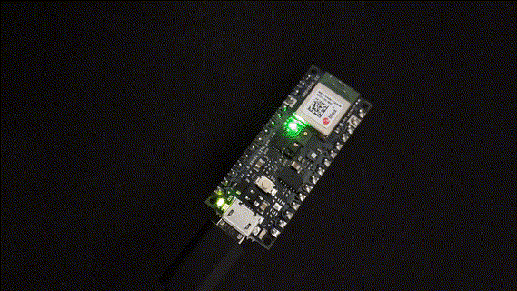

# Arduino example

Uses a model (trained [here](../%5BKeras%5D-Preprocess-Functional.ipynb)) to predict one of the (german) keywords `licht`/`party`/`aus` which turns on a white light / enters a blinking light 'party mode' or / turns off all lights.

This is derived from the [Arduino_TensorflowLite](https://www.arduino.cc/reference/en/libraries/arduino_tensorflowlite/) micro_speech example. Since the model is bigger and takes longer to predict one instance than the original one, the `kTensorArenaSize` has to be increased as well as the `average_window_duration_ms` when creating the RecognizeCommands instance. The default `detection_threshold` was to high, so this is lowered to reliably predict keywords.
```cpp
constexpr int kTensorArenaSize = 65 * 1024; // line 45

static RecognizeCommands static_recognizer(error_reporter, 2000, 70); // line 124
```
## Party mode:
